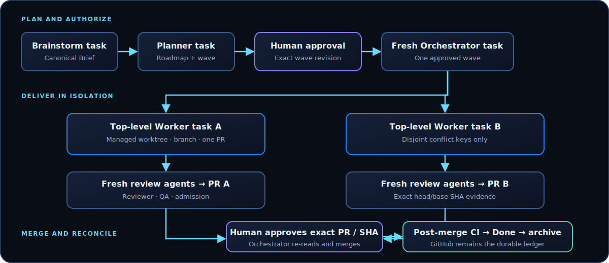

# Orchestration

This page is the canonical task topology. Other pages refer here instead of duplicating it.



Codex subagents reduce main-task context pollution but consume additional tokens. Use them for bounded review/QA, not as recursive write fan-out. Managed worktrees isolate top-level task changes. Probe current task/worktree/scheduling capabilities before relying on them.

## Start and materialize

One fresh Orchestrator handles one approved materialization or one approved wave. Its human-approved Start Packet binds both Global Roadmap and Phase Plan revisions/digests, base SHA, exact approved `plan_item_id` values, mode, expiry, and named approver before Issues exist.

`materialization_only` authorizes exact GitHub ledger setup and no Worker activity. `wave_execution` authorizes at most five top-level Worker launches, at most two concurrent writers on disjoint conflict keys, managed worktrees, monitoring, high-risk review tasks, post-Done archive, and merge only after a later exact authorization.

Orchestrator does not write product code, infer missing fields, or invent backlog. It runs `validatePlanContracts` and `evaluateOrchestratorStart` before writes, materializes exactly and idempotently, verifies every GitHub mutation, and publishes one Plan Materialization Report comment on the approved report-parent Issue.

GitHub preflight must prove repository access and Project mutation/readback coverage. A browser session or a narrative claim is not typed multi-item readback. If scopes or mutation capabilities are missing, stop before writes with Human Action Required.

## Materialization-only Start prompt — EN

```text
Use $github-agent-orchestrator in a fresh top-level Codex task for <owner/repo> in materialization_only mode.
Global Roadmap Packet: <complete-approved-json>
Phase Plan Packet: <complete-approved-json>
Start Packet: <complete-approved-json>
Recompute both packet digests, run validatePlanContracts with approval required, and validate the Start Packet before any write. Materialize the exact approved item set top-down, create native relationships and Project fields, read every write back, and publish one Plan Materialization Report on the approved parent Issue. Create no claims, Workers, heartbeat, branches, PRs, or merge actions. Do not infer or repair missing content; return Human Action Required instead.
```

## Промпт materialization-only — RU

```text
Используй $github-agent-orchestrator в новой top-level Codex task для <owner/repo> в режиме materialization_only.
Global Roadmap Packet: <полный-утверждённый-json>
Phase Plan Packet: <полный-утверждённый-json>
Start Packet: <полный-утверждённый-json>
До любой записи пересчитай оба packet digests, запусти validatePlanContracts с обязательным approval и проверь Start Packet. Материализуй точный утверждённый набор сверху вниз, создай native relationships и Project fields, прочитай каждую запись обратно и опубликуй один Plan Materialization Report в утверждённом parent Issue. Не создавай claims, Workers, heartbeat, branches, PR или merge actions. Не додумывай и не исправляй отсутствующие данные; вместо этого верни Human Action Required.
```

## Wave-execution Start prompt — EN

```text
Use $github-agent-orchestrator in a fresh top-level Codex task for exactly one wave in saved project <project> in wave_execution mode.
Global Roadmap Packet: <complete-approved-json>
Phase Plan Packet: <complete-approved-json>
Start Packet: <complete-approved-json>
Validate all revisions, digests, exact Ready IDs, conflict keys, base SHA, expiry, and authority before any write. Materialize the exact approved contracts, then create at most five fresh top-level Worker tasks in managed worktrees, keep at most two disjoint write Workers, monitor/steer them, create required top-level high-risk review tasks, and archive Workers only after post-merge Done. Do not fork this task, write product code, invent backlog, publish local paths, or merge without a separate exact PR/head-SHA authorization.
```

## Промпт wave-execution — RU

```text
Используй $github-agent-orchestrator в новой top-level Codex task ровно для одной wave в saved project <project> в режиме wave_execution.
Global Roadmap Packet: <полный-утверждённый-json>
Phase Plan Packet: <полный-утверждённый-json>
Start Packet: <полный-утверждённый-json>
До любой записи проверь все revisions, digests, точные Ready IDs, conflict keys, base SHA, expiry и authority. Материализуй точные утверждённые contracts, затем создай не более пяти новых top-level Worker tasks в managed worktrees, держи максимум двух непересекающихся write Workers, мониторь/направляй их, создавай нужные top-level high-risk review tasks и архивируй Workers только после post-merge Done. Не делай fork этой task, не пиши продуктовый код, не придумывай backlog, не публикуй локальные пути и не merge без отдельного разрешения на точные PR/head SHA.
```

## Transactional launch and concurrency

Claim → `CREATING` → `LAUNCHED`. A queued/client ID is not a launch. Count only matching canonical task/worktree IDs with top-level/managed ownership and verified ready/running state. On ambiguity, search existing tasks before retrying; on creation failure, release the claim without consuming a launch. Never use `fork_thread`, `/private/tmp`, or a handmade worktree as the normal execution surface.

Build the occupied set from active `conflict_keys`. A Worker that discovers an extra overlapping surface stops before writes and returns Surface Update. Stale claim recovery requires task absence, three missed heartbeats, and no branch or PR.

## Worker launch prompt — EN

```text
Use $github-agent-worker in this fresh top-level managed-worktree task.
Raw Issue: <issue-url-and-body>
Worker Packet: <worker-packet>
Canonical revisions: <links-and-revisions>
Work on exactly this leaf as the sole tracked-file author. Verify owner layer/conflict keys before writing; return Surface Update if they expand. Use TDD, bounded fresh review agents, branch CI, base freshness, clean tracked tree, and distinct admission-reviewer evidence. Do not create Issues or merge.
```

## Промпт запуска Worker — RU

```text
Используй $github-agent-worker в этой новой top-level managed-worktree task.
Raw Issue: <issue-url-and-body>
Worker Packet: <worker-packet>
Canonical revisions: <links-and-revisions>
Работай только над этим leaf как единственный автор tracked files. До записи проверь owner layer/conflict keys; при расширении верни Surface Update. Используй TDD, ограниченных свежих review agents, branch CI, fresh base, clean tracked tree и evidence отдельного admission-reviewer. Не создавай Issues и не merge.
```

## Findings, merge, and post-merge

Worker returns Finding Packets; Orchestrator performs authoritative duplicate search, returns in-scope fixes, creates proven independent Low/Medium Bugs, and escalates High/security/data/migration/product ambiguity.

After a repository/PR/head/base/admission-digest-bound Merge Authorization Packet, Orchestrator re-reads every binding, checks, dependencies, and threads. Any change cancels authorization. A valid merge uses `expected_head_sha`, requires canonical merge-commit readback and post-merge CI bound to that commit, and reaches Done/archive only after this evidence passes.

## Heartbeat and Handoff

Attach the 20-minute schedule only while work is active; pause when idle or awaiting a human. At wave completion or five launches, stop launching and hand off.

### Handoff / takeover prompt — EN

```text
Use $github-agent-orchestrator in a fresh top-level task. Reconstruct wave <wave-id> from GitHub and canonical contracts using this Orchestrator State/Handoff Packet: <packet>. Do not trust prior chat history. Verify every claim, task ID, branch, PR, SHA, attempt, and heartbeat. Write takeover readback before the old Orchestrator is archived. Do not launch until the handoff is accepted.
```

### Промпт handoff / takeover — RU

```text
Используй $github-agent-orchestrator в новой top-level task. Восстанови wave <wave-id> из GitHub и canonical contracts по этому Orchestrator State/Handoff Packet: <packet>. Не доверяй истории прошлого чата. Проверь каждый claim, task ID, branch, PR, SHA, attempt и heartbeat. Запиши takeover readback до архивирования старого Orchestrator. Не запускай Workers до принятия handoff.
```
